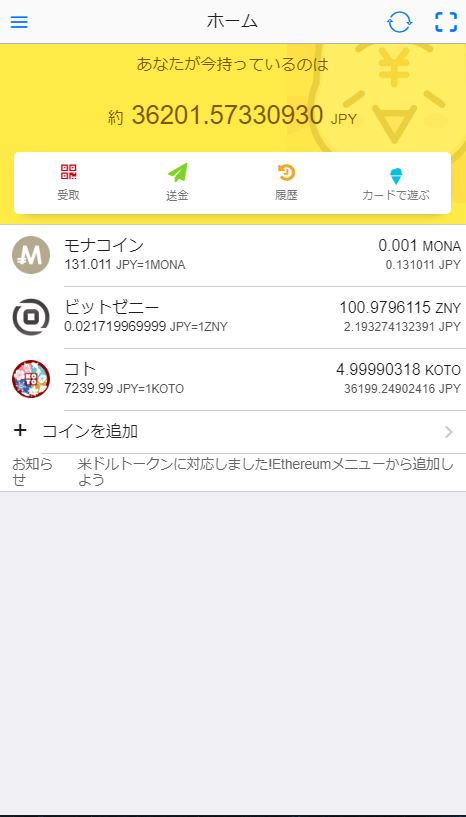
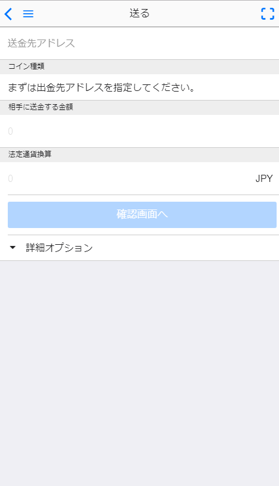
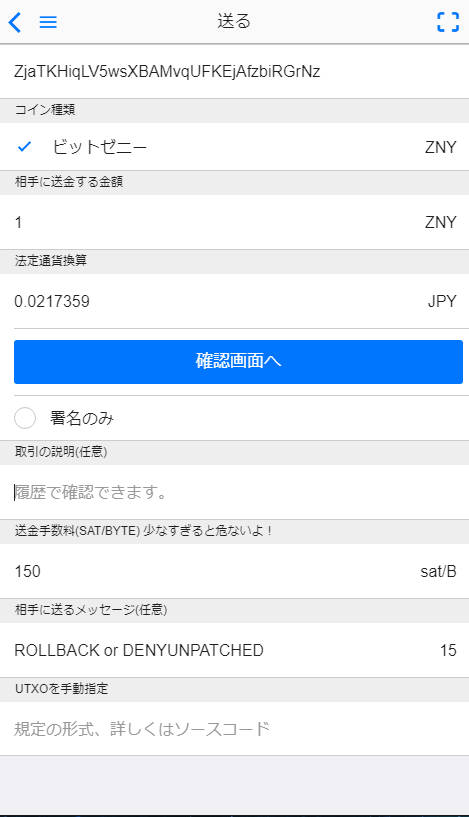
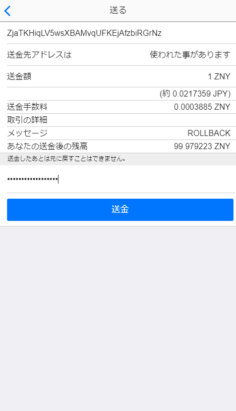
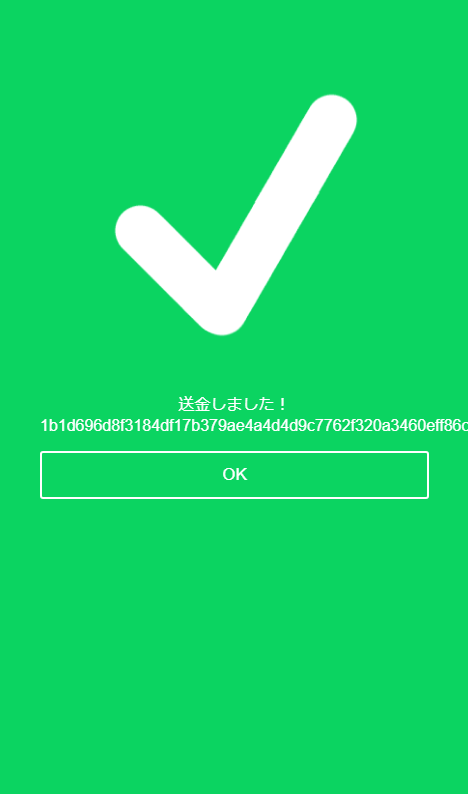

# もにゃで投票する
bitzeny-holder-opinionにもにゃで参加する方法です。

## STEP1
もにゃを開く \


## STEP2
送金画面を開く \


## STEP3
- ```ZjaTKHiqLV5wsXBAMvqUFKEjAfzbiRGrNz``` を送金するアドレス欄に入力
- 送る金額を入力
- 相手に送るメッセージの欄に 自分が投票したい対処法の英単語を入力する \
  (例) ```ROLLBACK``` ```DENYUNPATCHED``` 詳しくは README.md を参照


## STEP4
確認画面へ移行しパスワードを入力して送金する \


## STEP5
Success!! \

